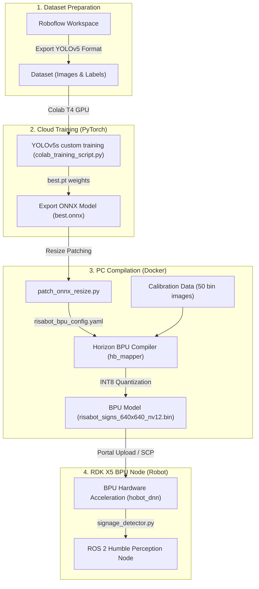

# RISA-Bot Architecture

Competition-mode autonomous vehicle platform built on **ROS 2 Humble** and hosted on the **Horizon Sunrise RDK X5**.

---

## 1. Node & Topic Communication Graph

```mermaid
graph TD
    subgraph Sensors ["Sensors & Hardware"]
        CAM["Astra Mini Camera"]
        LIDAR["YDLiDAR Tmini Plus"]
        IMU["Rosmaster IMU (Pitch/RPY)"]
        JOY["Joy Node (/dev/input/js0)"]
        BOARD["Rosmaster Motor Board (CH340)"]
    end

    subgraph Perception ["Perception Nodes"]
        LF["line_follower_camera (31 Hz)"]
        OA_LID["obstacle_avoidance (LiDAR)"]
        OA_CAM["obstacle_avoidance_camera (Canny)"]
        TL["traffic_light_detector (HSV)"]
        BG["boom_gate_detector (LiDAR + Camera Red Bar)"]
        TUN["tunnel_wall_follower (RANSAC)"]
        OBS["obstruction_avoidance"]
        PARK["parking_controller (Odom + Record/Playback)"]
        SIG["signage_detector (Horizon BPU YOLOv5s)"]
    end

    subgraph SLAM_Stack ["SLAM & Transform Stack"]
        TF_LASER["base_to_laser (Static TF, yaw=pi)"]
        TF_ODOM["odom_tf_publisher (25 Hz)"]
        SLAM["slam_toolbox (async_slam_toolbox_node)"]
    end

    subgraph Control ["Decision, Safety & Hardware Bridge"]
        AD["auto_driver (50 Hz Brain)"]
        CSC["cmd_safety_controller"]
        SC["servo_controller"]
        HM["health_monitor"]
    end

    subgraph Interface ["Services & Companion Interface"]
        DASH["ROS Web Dashboard (:8080)"]
        PORTAL["FastAPI WiFi & Model Portal (:8000)"]
        BRIDGE["ros2go2rtc_bridge (:1985)"]
        G2R["go2rtc Streaming Server (:1984)"]
        APP["RisaBotApp (Desktop Companion)"]
    end

    %% Sensor to Perception / Bridge
    CAM -->|"/camera/color/image_raw"| LF
    CAM -->|"/camera/color/image_raw"| OA_CAM
    CAM -->|"/camera/color/image_raw"| TL
    CAM -->|"/camera/color/image_raw"| BG
    CAM -->|"/camera/color/image_raw"| SIG
    CAM -->|"/camera/color/image_raw"| BRIDGE

    LIDAR -->|"/scan"| OA_LID
    LIDAR -->|"/scan"| BG
    LIDAR -->|"/scan"| TUN
    LIDAR -->|"/scan"| OBS
    LIDAR -->|"/scan"| SLAM
    LIDAR -->|"/scan"| DASH

    %% Perception to Auto Driver
    LF -->|"/lane_error + /lane_lost"| AD
    OA_LID -->|"/obstacle_front"| AD
    OA_CAM -->|"/obstacle_detected_camera"| AD
    TL -->|"/traffic_light_state"| AD
    BG -->|"/boom_gate_open"| AD
    TUN -->|"/tunnel_detected + /tunnel_cmd_vel"| AD
    OBS -->|"/obstruction_active + /obstruction_cmd_vel"| AD
    PARK -->|"/parking_cmd_vel + /parking_complete + /parking_status"| AD
    SIG -->|"/parking_signboard_detected + /hill_sign_detected + /traffic_light_state"| AD

    %% SLAM Connections
    SC -->|"/odom/path_length"| TF_ODOM
    SC -->|"/imu/rpy"| TF_ODOM
    TF_ODOM -->|"TF: odom -> base_link"| SLAM
    TF_LASER -->|"TF: base_link -> laser_frame (pi)"| SLAM
    SLAM -->|"/map (OccupancyGrid)"| DASH
    DASH -->|"/api/slam/map.png"| APP

    %% Auto Driver to Safety to Hardware
    AD -->|"/cmd_vel_auto_raw"| CSC
    AD -->|"/parking_command"| PARK
    AD -->|"/record_playback_cmd"| SC
    AD -->|"/obstacle_detected_fused + /dashboard_state + /loop_stats"| DASH

    CSC -->|"/cmd_vel_auto"| SC
    CSC -->|"/cmd_safety_status + /loop_stats"| DASH

    JOY -->|"/joy"| SC
    JOY -->|"/joy"| DASH

    SC -->|"Rosmaster_Lib (serial /dev/myserial)"| BOARD
    SC -->|"/cmd_vel + /odom + /imu/pitch + /auto_mode + /set_challenge"| DASH
    SC -->|"/auto_mode + /set_challenge + /odom + /imu/pitch"| AD
    SC -->|"/odom"| PARK

    %% Diagnostics & Video Streaming
    HM -->|"/health_status"| DASH
    BRIDGE -->|"MJPEG :1985"| G2R
    G2R -->|"WebRTC/MJPEG :1984"| DASH & APP
    PORTAL <-->|"REST API :8000"| APP
```

---

## 2. Multi-Service Network Architecture

| Port | Service | Process / Host | Description |
|---|---|---|---|
| **8000** | Provisioning & Launch Portal | `tools/wifi_provisioning/backend/app.py` (FastAPI + uvicorn) | WiFi setup, BPU model upload/info/rollback, and `systemctl start/stop risabot` |
| **8080** | ROS 2 Web Dashboard | `dashboard.py` + `dashboard_templates.py` (stdlib HTTP) | Telemetry HUD, live parameter Get/Set/Save Defaults, SLAM PNG map stream, Data Logger, camera view router |
| **1984** | go2rtc Streaming Server | `tools/go2rtc/` (go2rtc binary) | Low-latency WebRTC/MJPEG streaming to browsers and desktop app |
| **1985** | Camera Stream Bridge | `ros2go2rtc_bridge.py` | ROS image topic subscriber serving MJPEG on `:1985` for go2rtc |

---

## 3. Autonomous State Machine (`auto_driver`)

The central brain (`auto_driver.py`) runs a priority-ordered state machine on a **50 Hz timer** (`0.02 s`). It evaluates priorities strictly from top to bottom on each tick and selects exactly one behavior:

| Priority | State Enum | Trigger / Gating Condition | Action / Velocity Source |
|---|---|---|---|
| **1** | `MANUAL` | `/auto_mode == false` | No autonomous `/cmd_vel` published (RC pass-through) |
| **2** | `FINISHED` | Lap 2 + final perpendicular parking maneuver completed | Full stop |
| **2.5** | `TRAFFIC_LIGHT` | Red or Yellow light detected (AI BPU / HSV) | Full stop; latches until green light confirmed |
| **2.6** | `BOOM_GATE` | Gate barrier detected closed (LiDAR variance + camera red bar) | Full stop until gate clears for hysteresis duration |
| **3** | `EMERGENCY_STOP` | `/cmd_safety_status` e-stop active or safety timeout | Full stop |
| **4** | `OBSTRUCTION` | LiDAR obstacle in lane closer than `detect_dist` | Uses `/obstruction_cmd_vel` (lateral dodge trajectory) |
| **4.5** | `REVERSE_ADJUST` | Front obstacle too close (< minimum clearance) | Reverse slowly with center steering |
| **5** | `ROUNDABOUT` | Lap 1 + after obstruction clears | Lane follow for `t_roundabout_sec` with exit bias |
| **6** | `PARKING_IDLE` | Lap 2 + parking signboard detected | Full stop for `parking_idle_duration` before maneuver |
| **6.5** | `PARKING_PLAYBACK` | Parking idle complete / teach-and-playback trigger | Replays recorded 20 Hz trajectory via `servo_controller` |
| **7** | `TUNNEL` | Both corridor walls detected by LiDAR | Uses `/tunnel_cmd_vel` (RANSAC PD wall centering) |
| **9.5** | `HILL` | IMU pitch > `hill_pitch_threshold` (primed by hill sign) | Dynamic speed boost proportional to pitch angle |
| **9.6** | `DESCENT` | IMU pitch < negative threshold (downhill slope) | Controlled braking speed with lane tracking |
| **10** | `LANE_RECOVERY` | `/lane_lost == true` (no valid scanline detection) | Holds last known heading briefly, then stops |
| **11** | `LANE_FOLLOW` | Default autonomous state | Steers using `/lane_error` via PID controller |

---

## 4. AI / BPU Hardware Acceleration Architecture

The `signage_detector` node leverages a custom-trained **YOLOv5s** model running hardware-accelerated INT8 inference on the Horizon RDK X5 BPU (using `hobot_dnn` / `pyeasy_dnn`).

### Compilation & Deployment Pipeline

```mermaid
graph TD
    subgraph Dataset ["1. Dataset Preparation"]
        Roboflow["Roboflow Workspace"] -->|Export YOLOv5 Format| Images["Dataset (Images & Labels)"]
    end

    subgraph Training ["2. Cloud Training (PyTorch)"]
        Images -->|Colab T4 GPU| Train["YOLOv5s custom training (colab_training_script.py)"]
        Train -->|best.pt weights| Export["Export ONNX Model (best.onnx)"]
    end

    subgraph Compilation ["3. PC Compilation (Docker)"]
        Export -->|Resize Patching| Patch["patch_onnx_resize.py"]
        Patch -->|risabot_bpu_config.yaml| Mapper["Horizon BPU Compiler (hb_mapper)"]
        CalibData["Calibration Data (50 bin images)"] --> Mapper
        Mapper -->|INT8 Quantization| Bin["BPU Model (risabot_signs_640x640_nv12.bin)"]
    end

    subgraph Deployment ["4. RDK X5 BPU Node (Robot)"]
        Bin -->|Portal Upload / SCP| BPU_Runtime["BPU Hardware Acceleration (hobot_dnn)"]
        BPU_Runtime -->|signage_detector.py| ROS2["ROS 2 Humble Perception Node"]
    end
```

### Real-Time Inference Pipeline

```mermaid
graph TD
    CAM["Astra Mini Camera"] -->|"/camera/color/image_raw (BGR)"| Sub["1. Subscriber Callback"]
    Sub -->|OpenCV BGR| Pre["2. Preprocessing"]
    
    subgraph Preprocessing ["Perception Preprocessing"]
        Pre --> Resize["Resize to 640x640"]
        Resize --> YUV["Convert to YUV I420"]
        YUV --> Interleave["Interleave UV Planar Components"]
        Interleave --> NV12["Construct BPU-Native NV12 Layout"]
    end

    NV12 -->|Zero-Copy Input| BPU_Forward["3. BPU Forward Pass (pyeasy_dnn.forward)"]
    BPU_Forward -->|Raw Output Tensor (1, 25200, 11)| Post["4. Postprocessing (CPU)"]

    subgraph Postprocessing ["Perception Postprocessing"]
        Post --> Squeeze["Squeeze Output to 2D (25200, 11)"]
        Squeeze --> Filter["Per-Class Confidence Filtering"]
        Filter --> NMS["Vectorized NMS (IoU Threshold = 0.45)"]
        NMS --> Latch["Consecutive Frame Hysteresis Gating"]
    end

    Latch -->|Detections| Pubs["5. State Publishers"]

    subgraph Output ["ROS 2 Topics"]
        Pubs -->|"/parking_signboard_detected (Bool)"| AD_Park["auto_driver"]
        Pubs -->|"/hill_sign_detected (Bool)"| AD_Hill["auto_driver"]
        Pubs -->|"/traffic_light_state (String)"| AD_TL["auto_driver"]
        Pubs -->|"/camera/debug/signage (Image)"| DASH["dashboard / bridge"]
    end
```

### BPU Class Mapping

| Index | Class Name | Usage / Action in Autonomous Stack |
|---|---|---|
| **0** | `Bumper_signboard` | Disabled (`thresh=0.99`) — handled by physical compliance |
| **1** | `Hill_signboard` | Primes IMU pitch trigger window for Challenge 5 (Hill Climb) |
| **2** | `Obstacle_signboard`| Disabled (`thresh=0.99`) — handled by LiDAR obstacle avoidance |
| **3** | `ParallelP_signboard` | Triggers Parallel Parking sequence on Lap 2 |
| **4** | `PerpendP_signboard`  | Triggers Perpendicular Parking sequence on Lap 2 |
| **5** | `Roundabout_signboard`| Gated (`thresh=0.50`) — suppresses false triggers |
| **6** | `Traffic_Green` | Releases traffic light stop latch → resumes driving |
| **7** | `Traffic_Red`   | Triggers Priority 2.5 emergency stop |
| **8** | `Trafficlight_signboard` | Generic traffic light box; re-classified via CV ROI |
| **9** | `null` | Background null class (ignored) |

---

## 5. SLAM & Mapping Pipeline

1. **LiDAR Physical Mounting Correction**: The YDLiDAR Tmini Plus is mounted with its cable forward and optical 0° facing rearward.
   - `tf2_ros static_transform_publisher` broadcasts `base_link -> laser_frame` with `yaw = 3.14159265` ($\pi$ rad).
   - Driver `range_min` is set to `0.15 m` to filter out chassis frame self-hits.
2. **Odometry Transform (`odom_tf_publisher`)**:
   - Subscribes to `/odom/path_length` (calibrated encoder distance at 6249 ticks/meter) and `/imu/rpy` (IMU yaw).
   - Broadcasts `odom -> base_link` at **25 Hz**.
3. **Scan Matcher & Occupancy Grid (`slam_toolbox`)**:
   - Runs `async_slam_toolbox_node` using `mapper_params_online_async.yaml`.
   - Publishes `/map` (`nav_msgs/msg/OccupancyGrid`).
4. **Dashboard & App Transport**:
   - `dashboard.py` encodes the occupancy grid to a greyscale PNG using native `zlib` and `struct` (reducing a ~250 KB JSON payload to ~5–20 KB).
   - The Companion App polls `/api/slam/status` every second and fetches `/api/slam/map.png` only when `map_seq` increments.
   - **Restart Mapping**: Handled via process PID search, `SIGINT`, and launch file `respawn=True` (~2 s reset).

---

## 6. Key Source Files Reference

| Subsystem | File Path | Purpose |
|---|---|---|
| **Brain** | [`auto_driver.py`](src/risabot_automode/risabot_automode/auto_driver.py) | 17-state autonomous decision engine |
| **Hardware Bridge** | [`servo_controller.py`](src/control_servo/control_servo/servo_controller.py) | Rosmaster motor/servo serial interface & odometry |
| **Safety** | [`cmd_safety_controller.py`](src/risabot_automode/risabot_automode/cmd_safety_controller.py) | Acceleration limits, speed clamps, and e-stop |
| **Lane Perception** | [`line_follower_camera.py`](src/risabot_automode/risabot_automode/line_follower_camera.py) | Vectorized multi-scanline Kalman lane detector |
| **BPU AI** | [`signage_detector.py`](src/risabot_automode/risabot_automode/signage_detector.py) | YOLOv5s hardware-accelerated inference |
| **Barrier Perception**| [`boom_gate_detector.py`](src/risabot_automode/risabot_automode/boom_gate_detector.py) | Dual LiDAR variance + camera red bar detector |
| **Tunnel Perception** | [`tunnel_wall_follower.py`](src/risabot_automode/risabot_automode/tunnel_wall_follower.py) | LiDAR RANSAC corridor wall tracker |
| **Obstacle Avoidance**| [`obstruction_avoidance.py`](src/risabot_automode/risabot_automode/obstruction_avoidance.py) | Lateral steering dodge trajectory generator |
| **Parking Control** | [`parking_controller.py`](src/risabot_automode/risabot_automode/parking_controller.py) | Odometry parking & record/playback maneuvers |
| **SLAM Transform** | [`odom_tf_publisher.py`](src/risabot_slam/risabot_slam/odom_tf_publisher.py) | Distance + IMU yaw TF broadcaster |
| **Web Dashboard** | [`dashboard.py`](src/risabot_automode/risabot_automode/dashboard.py) | HTTP/WebSocket telemetry & parameter server |
| **Camera Bridge** | [`ros2go2rtc_bridge.py`](src/risabot_automode/risabot_automode/ros2go2rtc_bridge.py) | ROS image topic to MJPEG bridge on port 1985 |
| **WiFi & Model Portal**| [`tools/wifi_provisioning/backend/app.py`](tools/wifi_provisioning/backend/app.py) | FastAPI service portal on port 8000 |
| **Desktop Companion**| [`RisaBotApp/`](RisaBotApp/) | WPF / .NET 10 desktop application |
