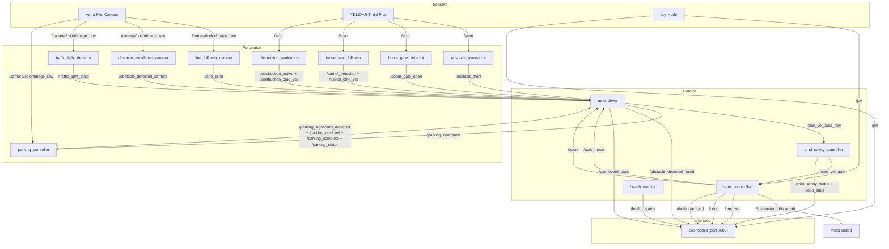

# RISA-Bot Architecture

Competition-mode autonomous vehicle built on ROS 2 Humble.

## Node / Topic Graph



## State Machine (auto_driver)

| Priority | State          | Trigger               | Action                      |
| -------- | -------------- | --------------------- | --------------------------- |
| 1        | MANUAL         | `auto_mode=false`     | No cmd_vel published        |
| 2        | FINISHED       | Lap 2 + perpendicular done | Full stop              |
| 3        | TRAFFIC_LIGHT  | Red/yellow detected   | Full stop                   |
| 4        | BOOM_GATE      | Gate closed           | Full stop                   |
| 4.2      | EMERGENCY_STOP | `/cmd_safety_status` estop true | Full stop        |
| 5        | OBSTRUCTION    | LiDAR lateral avoid   | Use `/obstruction_cmd_vel`  |
| 5.5      | REVERSE_ADJUST | Too close to obstacle | Reverse slowly              |
| 6        | PARALLEL_PARK  | Lap 2 + signboard (latched) | Use `/parking_cmd_vel` |
| 6        | PERPENDICULAR_PARK | Parallel complete  | Use `/parking_cmd_vel`      |
| 6        | TUNNEL         | Walls on both sides   | Use `/tunnel_cmd_vel`       |
| 7        | LANE_FOLLOW    | Default               | Steering from `/lane_error` |

## Competition Flow

```
Lap 1: START → Lane Follow → Obstruction → Roundabout →
        BoomGate1 → Tunnel → BoomGate2 →
        Hill → Bumper → TrafficLight → START

Lap 2: Lane Follow → Obstruction → Roundabout →
        Parallel Park → Drive → Perpendicular Park → FINISH
```

## Key Files

| File                        | Purpose                                 |
| --------------------------- | --------------------------------------- |
| `auto_driver.py`            | Central state machine (brain)           |
| `servo_controller.py`       | Hardware interface to Rosmaster board   |
| `dashboard.py`              | Web dashboard server                    |
| `dashboard_templates.py`    | HTML/CSS/JS for dashboard UI            |
| `line_follower_camera.py`   | Lane detection via camera               |
| `traffic_light_detector.py` | R/Y/G circle detection                  |
| `obstruction_avoidance.py`  | LiDAR lateral steering around obstacles |
| `tunnel_wall_follower.py`   | PD wall following in tunnel             |
| `boom_gate_detector.py`     | LiDAR gate barrier detection            |
| `parking_controller.py`     | Odometry-based parking maneuvers        |
| `health_monitor.py`         | Topic freshness and runtime health      |
| `config/params.yaml`        | Centralized tunable parameters          |
