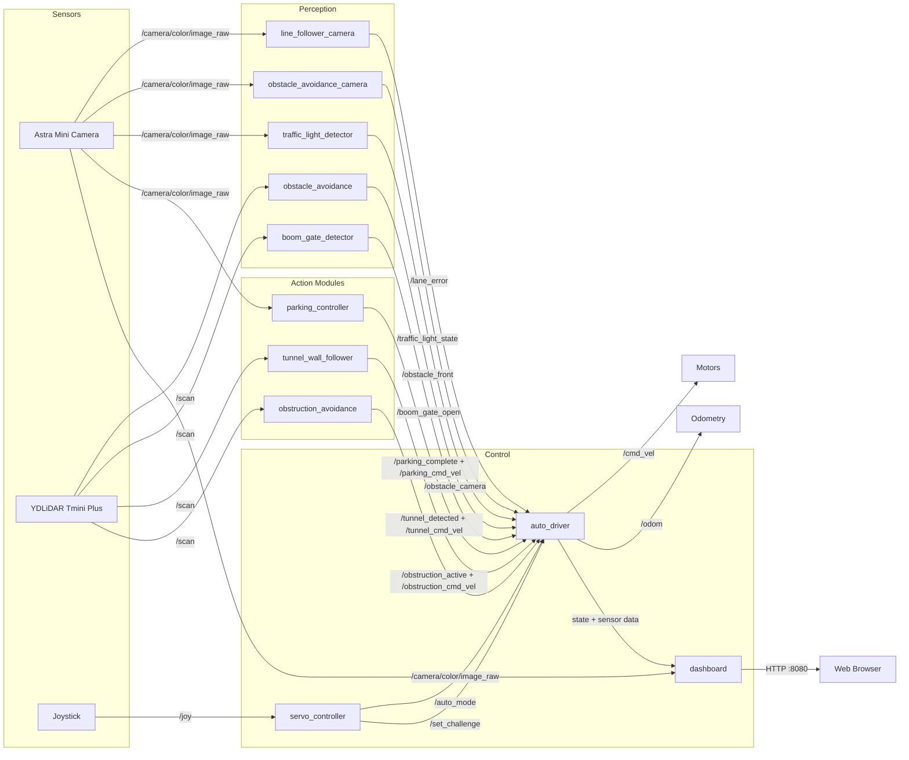

# Architecture

## Node Graph (Test Branch)



## Data Flow

```
Joystick → servo_controller → /auto_mode → auto_driver
                                              ↓
                                    State Machine (with lap tracking):
                                    ├─ LANE_FOLLOW → /lane_error → forward + steering
                                    ├─ OBSTRUCTION → /obstruction_cmd_vel
                                    ├─ TUNNEL → /tunnel_cmd_vel
                                    ├─ PARKING → /parking_cmd_vel
                                    ├─ DRIVE_TO_PERP → lane follow to perp area
                                    ├─ TRAFFIC_LIGHT → stop on red/yellow
                                    ├─ BOOM_GATE_1 → open lap 1, closed lap 2
                                    └─ BOOM_GATE_2 → random, stop if closed
                                              ↓
                                          /cmd_vel → Motors

Dashboard (port 8080):
    ├─ Subscribes to: state, mode, cmd_vel, lane_error, odom, joy,
    │   obstacle_front, obstacle_camera, tunnel_detected,
    │   traffic_light_state, boom_gate_open, parking_complete,
    │   obstruction_active, camera image
    ├─ Serves: live web dashboard with camera feed
    └─ Parameter tuning: native rclpy service clients (no subprocess)
```

## Package Map

```
RISA-bot/src/
├── risabot_automode/          ← Main package (both branches)
│   ├── risabot_automode/
│   │   ├── auto_driver.py         ← Brain: state machine + serial/odometry
│   │   ├── line_follower_camera.py ← Lane error from camera
│   │   ├── dashboard.py              ← [test only] Web dashboard (HTTP :8080)
│   │   ├── traffic_light_detector.py  ← [test only] HSV circle detection
│   │   ├── boom_gate_detector.py      ← [test only] LiDAR barrier detection
│   │   ├── tunnel_wall_follower.py    ← [test only] PD wall following
│   │   ├── obstruction_avoidance.py   ← [test only] Lateral dodge
│   │   └── parking_controller.py      ← [test only] Parallel/perp parking
│   ├── launch/
│   │   ├── bringup.launch.py     ← Main branch launcher
│   │   └── competition.launch.py ← Test branch launcher (all nodes)
│   └── config/
│       └── ydlidar.yaml
├── control_servo/             ← Joystick controller
│   └── control_servo/
│       └── servo_controller.py   ← Mode toggle + manual driving + joy watchdog
├── obstacle_avoidance/        ← LiDAR front obstacle detection
├── obstacle_avoidance_camera/ ← Camera obstacle detection
├── ros2_astra_camera/         ← Camera driver (third-party)
└── ydlidar_ros2_driver/       ← LiDAR driver (third-party)
```

## Safety Feature: Joystick Watchdog

The `servo_controller` includes a watchdog that monitors `/joy` messages:

- If no joystick message is received for **0.5 seconds**, the robot stops all motors
- Prevents the robot from moving autonomously when the controller is turned off or disconnected
- Manual driving is disabled until the first valid `/joy` message is received
