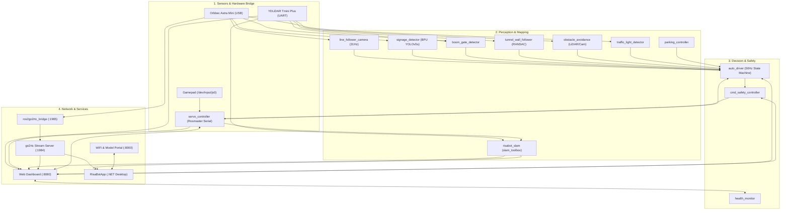
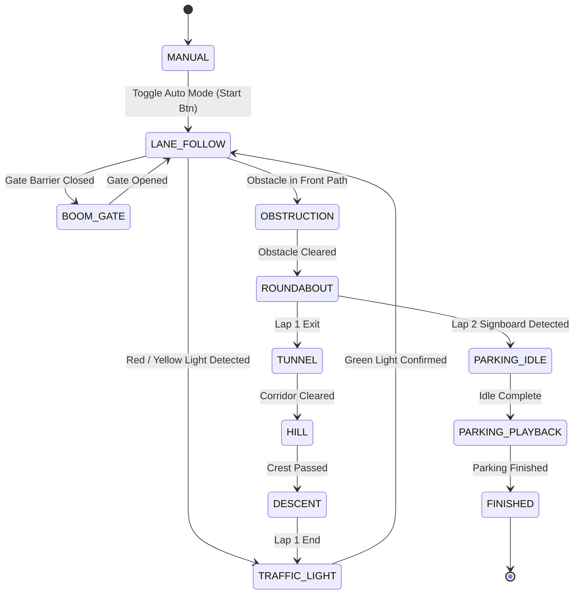
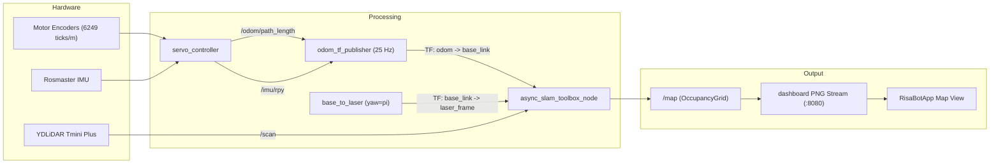

# System Architecture & Technical Design

This document details the software architecture, data flow, inter-process communication, and hardware interfaces of the RISA-bot platform.

---

## 1. High-Level Software Stack

The RISA-bot software stack is composed of 4 main layers:
1. **Sensors & Hardware Interfaces**: Communicates with the physical camera, LiDAR, IMU, game controller, and motor expansion board.
2. **Perception & SLAM**: Extracts features from camera and LiDAR, performs BPU neural network inference, and constructs real-time occupancy grids.
3. **Decision & Safety**: Arbitrates behaviors using a 17-state priority state machine (`auto_driver`) and enforces kinematic safety limits (`cmd_safety_controller`).
4. **Network & Services**: Multi-service layer hosting the Web Dashboard, companion desktop API, low-latency video streaming, and provisioning portal.


```mermaid
graph TD
    subgraph Layer1 ["1. Sensors & Hardware Bridge"]
        CAM["Orbbec Astra Mini (USB)"]
        LIDAR["YDLiDAR Tmini Plus (UART)"]
        JOY["Gamepad (/dev/input/js0)"]
        SC["servo_controller (Rosmaster Serial)"]
    end

    subgraph Layer2 ["2. Perception & Mapping"]
        LF["line_follower_camera (31Hz)"]
        SIG["signage_detector (BPU YOLOv5s)"]
        BG["boom_gate_detector"]
        TUN["tunnel_wall_follower (RANSAC)"]
        OA["obstacle_avoidance (LiDAR/Cam)"]
        TL["traffic_light_detector"]
        PARK["parking_controller"]
        SLAM["risabot_slam (slam_toolbox)"]
    end

    subgraph Layer3 ["3. Decision & Safety"]
        AD["auto_driver (50Hz State Machine)"]
        CSC["cmd_safety_controller"]
        HM["health_monitor"]
    end

    subgraph Layer4 ["4. Network & Services"]
        DASH["Web Dashboard (:8080)"]
        PORTAL["WiFi & Model Portal (:8000)"]
        G2R["go2rtc Stream Server (:1984)"]
        BRIDGE["ros2go2rtc_bridge (:1985)"]
        APP["RisaBotApp (.NET Desktop)"]
    end

    CAM --> LF & SIG & BG & TL & BRIDGE
    LIDAR --> BG & TUN & OA & SLAM & DASH
    SC --> SLAM & AD & DASH

    LF & SIG & BG & TUN & OA & TL & PARK --> AD
    AD --> CSC --> SC
    JOY --> SC

    SLAM --> DASH & APP
    BRIDGE --> G2R --> DASH & APP
    PORTAL <--> APP
    DASH <--> AD & CSC & SC & HM
```

---

## 2. Decision Engine (`auto_driver`) State Machine

The robot's autonomous decision logic is encapsulated within `src/risabot_automode/risabot_automode/auto_driver.py`. The node ticks on a **50 Hz timer** (`0.02 s`) and evaluates the priority hierarchy:


```mermaid
stateDiagram-v2
    [*] --> MANUAL
    MANUAL --> LANE_FOLLOW: Toggle Auto Mode (Start Btn)
    LANE_FOLLOW --> TRAFFIC_LIGHT: Red / Yellow Light Detected
    TRAFFIC_LIGHT --> LANE_FOLLOW: Green Light Confirmed
    LANE_FOLLOW --> BOOM_GATE: Gate Barrier Closed
    BOOM_GATE --> LANE_FOLLOW: Gate Opened
    LANE_FOLLOW --> OBSTRUCTION: Obstacle in Front Path
    OBSTRUCTION --> ROUNDABOUT: Obstacle Cleared
    ROUNDABOUT --> TUNNEL: Lap 1 Exit
    TUNNEL --> HILL: Corridor Cleared
    HILL --> DESCENT: Crest Passed
    DESCENT --> TRAFFIC_LIGHT: Lap 1 End
    ROUNDABOUT --> PARKING_IDLE: Lap 2 Signboard Detected
    PARKING_IDLE --> PARKING_PLAYBACK: Idle Complete
    PARKING_PLAYBACK --> FINISHED: Parking Finished
    FINISHED --> [*]
```

### Complete Priority Table

| Priority | State Enum | Description & Trigger | Primary Velocity Output |
|---|---|---|---|
| **1** | `MANUAL` | Joystick control mode (`auto_mode == false`) | None published (RC pass-through) |
| **2** | `FINISHED` | Lap 2 completed + final park achieved | Zero velocity (full stop) |
| **2.5** | `TRAFFIC_LIGHT` | Red or Yellow light detected (AI BPU / HSV) | Zero velocity (latched stop) |
| **2.6** | `BOOM_GATE` | Barrier detected closed | Zero velocity until clear |
| **3** | `EMERGENCY_STOP` | Failsafe timeout or `/e_stop` active | Zero velocity |
| **4** | `OBSTRUCTION` | Front obstacle in lane (< `detect_dist`) | Uses `/obstruction_cmd_vel` |
| **4.5** | `REVERSE_ADJUST` | Distance to obstacle < critical safety threshold | Reverse slowly |
| **5** | `ROUNDABOUT` | Roundabout circular navigation | Lane follow with exit bias |
| **6** | `PARKING_IDLE` | Lap 2 + parking sign detected | Zero velocity (fixed duration) |
| **6.5** | `PARKING_PLAYBACK` | Parking maneuver execution | Replays recorded 20Hz trajectory |
| **7** | `TUNNEL` | Corridor walls detected by LiDAR | Uses `/tunnel_cmd_vel` (RANSAC PD) |
| **9.5** | `HILL` | IMU pitch > `hill_pitch_threshold` | Pitch-proportional speed boost |
| **9.6** | `DESCENT` | IMU pitch < negative threshold | Controlled descent braking speed |
| **10** | `LANE_RECOVERY` | Lane markings lost | Heading decay / stopped |
| **11** | `LANE_FOLLOW` | Default tracking mode | Steers from `/lane_error` via PID |

---

## 3. SLAM & Odometry Data Flow


```mermaid
graph LR
    subgraph Hardware
        ENC["Motor Encoders (6249 ticks/m)"]
        IMU_HW["Rosmaster IMU"]
        LID_HW["YDLiDAR Tmini Plus"]
    end

    subgraph Processing
        SC_NODE["servo_controller"]
        TF_PUB["odom_tf_publisher (25 Hz)"]
        STATIC_TF["base_to_laser (yaw=pi)"]
        SLAM_NODE["async_slam_toolbox_node"]
    end

    subgraph Output
        MAP_TOPIC["/map (OccupancyGrid)"]
        PNG_STREAM["dashboard PNG Stream (:8080)"]
        APP_MAP["RisaBotApp Map View"]
    end

    ENC --> SC_NODE -->|"/odom/path_length"| TF_PUB
    IMU_HW --> SC_NODE -->|"/imu/rpy"| TF_PUB
    TF_PUB -->|"TF: odom -> base_link"| SLAM_NODE
    STATIC_TF -->|"TF: base_link -> laser_frame"| SLAM_NODE
    LID_HW -->|"/scan"| SLAM_NODE

    SLAM_NODE --> MAP_TOPIC --> PNG_STREAM --> APP_MAP
```

---

## 4. Package Structure Map

```
RISA-bot/src/
├── risabot_automode/              ← Primary autonomy & vision package
│   ├── risabot_automode/
│   │   ├── auto_driver.py         ← 17-state brain & priority decision engine
│   │   ├── line_follower_camera.py← 31Hz vectorized scanline lane follower
│   │   ├── signage_detector.py    ← Horizon BPU YOLOv5s hardware inference
│   │   ├── boom_gate_detector.py  ← LiDAR variance + Camera Red Bar detector
│   │   ├── tunnel_wall_follower.py← RANSAC corridor wall centering
│   │   ├── obstruction_avoidance.py← Lateral obstacle dodge trajectory
│   │   ├── parking_controller.py  ← Odometry & record-playback parking
│   │   ├── cmd_safety_controller.py← Failsafes, clamps, and e-stop
│   │   ├── health_monitor.py      ← Node freshness & loop frequency monitor
│   │   ├── dashboard.py           ← Web Dashboard server & SLAM PNG encoder
│   │   ├── dashboard_templates.py ← Dashboard HTML5/CSS/JS single-page app
│   │   ├── ros2go2rtc_bridge.py   ← Camera topic to MJPEG bridge (:1985)
│   │   ├── bag_regression_validator.py ← Automated bag regression tester
│   │   └── topics.py              ← Central topic name definitions
│   ├── launch/
│   │   ├── bringup.launch.py      ← Unified full competition launcher
│   │   ├── competition.launch.py  ← Monolithic competition launcher
│   │   └── lane_test.launch.py    ← Isolated lane follower test launcher
│   └── config/
│       ├── params.yaml            ← Centralized tunable parameters
│       └── disable_shm.xml        ← FastRTPS shared memory fix
├── risabot_slam/                  ← SLAM & mapping package
│   ├── risabot_slam/
│   │   ├── odom_tf_publisher.py   ← Odometry & IMU TF broadcaster (25Hz)
│   │   └── scan_restamper.py      ← LaserScan timestamp synchronizer
│   ├── launch/
│   │   └── slam_test.launch.py    ← Standalone SLAM mapping launcher
│   └── config/
│       └── mapper_params_online_async.yaml ← SLAM Toolbox configuration
├── control_servo/                 ← Hardware bridge & joystick interface
│   ├── control_servo/
│   │   ├── servo_controller.py    ← Yahboom Rosmaster serial bridge & odometry
│   │   └── topics.py              ← Hardware topic definitions
│   └── launch/
│       └── robot_rc.launch.py     ← Standalone manual RC driver launcher
├── obstacle_avoidance/            ← LiDAR obstacle detection node
├── obstacle_avoidance_camera/     ← Camera Canny edge obstacle detector
├── ros2_astra_camera/             ← Orbbec Astra Mini camera driver
└── ydlidar_ros2_driver/           ← YDLiDAR Tmini Plus driver
```
