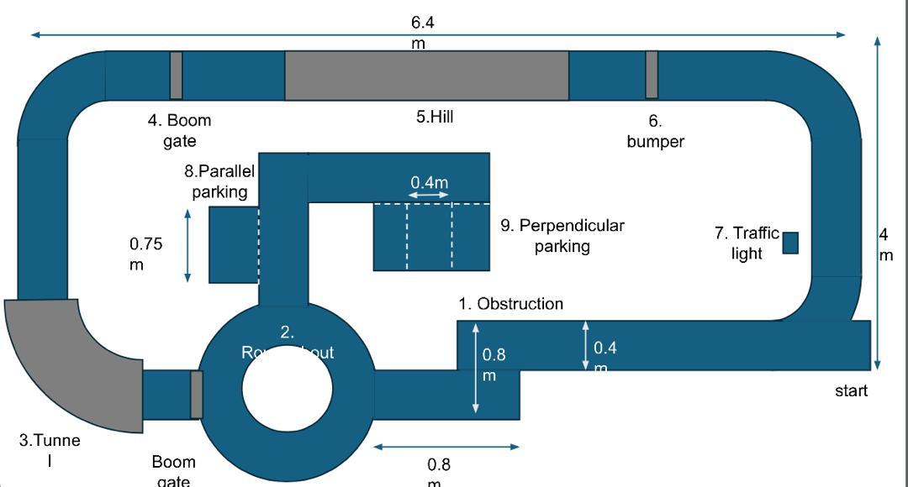

# Challenge & Code Breakdown

This guide explains how each competition challenge is implemented in the code (`src/risabot_automode/risabot_automode`).

## Competition Layout

**Course dimensions:** 6.4m × 4m. The robot starts at the bottom-right and follows the lane counter-clockwise.

### Challenge Order (Lap 1)

| # | Challenge | Location | Sensor Used |
|---|---|---|---|
| 1 | Obstruction | Bottom-center lane (0.8m × 0.4m block) | LiDAR |
| 2 | Roundabout | Bottom-left circle | Camera (lane follow) |
| 3 | Tunnel | Far-left corridor | LiDAR (wall follow) |
| 4 | Boom Gate | Top-left, after tunnel exit | LiDAR |
| 5 | Hill | Top-center ramp | Camera (lane follow) |
| 6 | Bumper | Top-right section | Camera (lane follow) |
| 7 | Traffic Light | Right side, before start | Camera (HSV) |

### Challenge Order (Lap 2 — Parking Path)

| # | Challenge | Location | Sensor Used |
|---|---|---|---|
| 8 | Parallel Parking | Inner top-left (0.75m slot) | Odometry + LiDAR |
| 9 | Perpendicular Parking | Inner top-center (0.4m slot) | Odometry + LiDAR |

> On Lap 2, the boom gate at the roundabout closes, forcing the robot into the inner parking area.

---

## 1. State Machine (`auto_driver.py`)

**File:** [auto_driver.py](../src/risabot_automode/risabot_automode/auto_driver.py)

The robot uses a **State Machine** with **lap tracking** to sequence through challenges. It does NOT try to detect everything at once — it only processes sensor data relevant to the current state.

### Competition Flow

```mermaid
graph LR
    subgraph "Lap 1"
        S["START"] --> LF1["Lane Follow"]
        LF1 -->|"obstruction detected"| OBS1["Obstruction"]
        OBS1 -->|"cleared + dist"| RB1["Roundabout"]
        RB1 -->|"exit 1"| BG1["Boom Gate 1 (open)"]
        BG1 --> TUN["Tunnel"]
        TUN -->|"exited"| BG2["Boom Gate 2 (random)"]
        BG2 -->|"open"| HILL["Hill"]
        HILL --> BUMP["Bumper"]
        BUMP --> TL["Traffic Light"]
        TL -->|"green + dist"| LF1
    end
    subgraph "Lap 2"
        LF2["Lane Follow"] -->|"obstruction"| OBS2["Obstruction"]
        OBS2 --> RB2["Roundabout"]
        RB2 -->|"exit 2 (gate closed)"| PP["Parallel Park"]
        PP -->|"complete"| DTP["Drive to Perp"]
        DTP -->|"dist"| PERP["Perp Park"]
        PERP --> FIN["FINISHED"]
    end
    TL -.->|"lap 2 starts"| LF2
```

**How it works:**

- `auto_driver` subscribes to **all** module topics
- `_check_transitions()` auto-advances state based on sensor events + distance
- `current_lap` tracks lap 1 vs lap 2 (increments after traffic light)
- In `publish_cmd_vel()`, it checks `self.state` and selects the right velocity source:
  - `TUNNEL` → ignores camera, uses `/tunnel_cmd_vel`
  - `PARKING` → ignores everything, uses `/parking_cmd_vel`
  - `LANE_FOLLOW` → uses camera `/lane_error` with `forward_speed` + `steering_gain`
  - `TRAFFIC_LIGHT` → stops on red/yellow, goes on green
  - `BOOM_GATE` → stops if gate closed
  - `DRIVE_TO_PERP` → lane follow from parallel to perpendicular parking area
- Stale data timeout (3s) prevents stuck states if a module crashes

---

## 2. Obstruction Avoidance (Challenge 1)

**File:** [obstruction_avoidance.py](../src/risabot_automode/risabot_automode/obstruction_avoidance.py)

**Topics:** `/obstruction_active` (Bool), `/obstruction_cmd_vel` (Twist)

**Obstacle size:** 0.8m long × 0.4m wide (see layout)

### How it works

1. **Detection:** LiDAR sees an object in the lane closer than `detect_dist`
2. **Decision:** Checks which side (left vs right) has more clearance
3. **Timed maneuver:**
   - **Phase 1 — Steer Out:** Turn away from obstacle for `steer_out_duration`
   - **Phase 2 — Pass:** Drive straight alongside obstacle for `pass_duration`
   - **Phase 3 — Return:** Turn back into lane for `steer_back_duration`
4. **Completion:** Sets `active=False` so `auto_driver` resumes lane following

---

## 3. Roundabout (Challenge 2)

**Handled by:** [auto_driver.py](../src/risabot_automode/risabot_automode/auto_driver.py) (ROUNDABOUT state)

### How it works

- Uses the **camera line follower** — the roundabout has painted lane lines
- The state machine enters `ROUNDABOUT` after passing Challenge 1
- On **Lap 1**, the roundabout exits to Boom Gate 1 (open) → tunnel path
- On **Lap 2**, Boom Gate 1 is closed, so the roundabout exits to the parking path
- The `dist_roundabout` parameter controls how far the robot travels before taking the exit

---

## 4. Tunnel (Challenge 3)

**File:** [tunnel_wall_follower.py](../src/risabot_automode/risabot_automode/tunnel_wall_follower.py)

**Topics:** `/tunnel_detected` (Bool), `/tunnel_cmd_vel` (Twist)

### How it works

1. **Input:** LiDAR scans (`/scan`)
2. **Wall Detection:** Splits scan points into Left side and Right side
3. **Error:** `error = left_dist - right_dist`
   - `error > 0` → closer to right wall → steer left
   - `error < 0` → closer to left wall → steer right
4. **PD Control:** `angular_vel = (kp × error) + (kd × derivative)`
5. **Why LiDAR?** Tunnels are dark — camera can't see lane lines reliably

**Tunable:** `kp`, `kd`, `target_center_dist`, `forward_speed`

---

## 5. Boom Gate (Challenge 4)

**File:** [boom_gate_detector.py](../src/risabot_automode/risabot_automode/boom_gate_detector.py)

**Topic:** `/boom_gate_open` (Bool)

### How it works

1. **Input:** LiDAR scans (`/scan`)
2. **ROI:** Looks at a narrow forward arc (±20°, 0.1m to 0.8m range)
3. **Detection:** If a **dense cluster** of points appears at similar distances (low variance = a horizontal bar), the gate is **CLOSED**
4. **Hysteresis:** Must see "open" for N consecutive frames before publishing `True` — prevents flickering

> There are **two boom gates** on the course:
> - **Boom Gate 1** (`BOOM_GATE_1`): After roundabout exit 1. Always open on Lap 1, closed on Lap 2
> - **Boom Gate 2** (`BOOM_GATE_2`): After the tunnel. Randomly open or closed — robot stops if closed, proceeds when open

**Tunable:** `min_gate_points`, `max_gate_dist`, `gate_angle_window`, `gate_dist_var_max`

---

## 6. Hill (Challenge 5)

**Handled by:** Lane following (no special module)

The hill is a physical ramp. The robot drives up and over it using normal camera lane following. No code changes needed — the camera still sees the lane lines on the ramp surface. May need slightly higher motor power (tunable via `forward_speed`).

---

## 7. Bumper (Challenge 6)

**Handled by:** Lane following (no special module)

Similar to the hill — the bumper is a physical obstacle on the ground that the robot drives over. Standard lane following handles this.

---

## 8. Traffic Light (Challenge 7)

**File:** [traffic_light_detector.py](../src/risabot_automode/risabot_automode/traffic_light_detector.py)

**Topic:** `/traffic_light_state` (String: "red", "yellow", "green", "unknown")

### How it works

1. **Input:** Color camera image (`/camera/color/image_raw`)
2. **HSV Thresholding:** Filters image for Red, Yellow, and Green color ranges
3. **Contour Detection:** Finds circular blobs matching traffic light colors
4. **Output:**
   - Red/Yellow detected → publishes `"red"` or `"yellow"` → robot stops
   - Green detected → publishes `"green"` → robot proceeds

> ⚠️ HSV thresholds are very sensitive to lighting. Always re-tune at the competition venue using `ros2 param set`.

---

## 9. Parallel Parking (Challenge 8)

**File:** [parking_controller.py](../src/risabot_automode/risabot_automode/parking_controller.py)

**Topics:** `/parking_cmd_vel`, `/parking_complete`

**Slot size:** 0.75m deep (see layout)

### How it works

1. `FORWARD` — Drive past the parking slot (distance measured via odometry)
2. `STEER_REVERSE` — Reverse while turning into the slot
3. `STRAIGHTEN` — Center wheels and reverse fully in
4. `WAIT` — Stop for 3 seconds (competition requirement)
5. `EXIT` — Drive forward and turn out to rejoin the lane

---

## 10. Perpendicular Parking (Challenge 9)

**File:** [parking_controller.py](../src/risabot_automode/risabot_automode/parking_controller.py)

**Slot size:** 0.4m wide (see layout)

### How it works

1. `TURN_IN` — 90° turn into the slot
2. `FORWARD` — Drive in until LiDAR detects the back wall
3. `WAIT` — Stop for required time
4. `REVERSE_OUT` — Back out and turn to rejoin the lane

---

## 11. Line Follower (Used Throughout)

**File:** [line_follower_camera.py](../src/risabot_automode/risabot_automode/line_follower_camera.py)

**Topic:** `/lane_error` (Float32)

### How it works

1. **Crop:** Takes bottom 40% of camera image (road surface)
2. **Threshold:** Filters for white pixels (lane markings)
3. **Histogram:** Sums white pixels per column to find lane line peaks
4. **Midpoint:** Center between left and right lane lines
5. **Error:** `error = image_center - lane_center`
6. **Smoothing:**
   - **Dead zone** (<0.03) → drive straight on straights
   - **EMA filter** → removes camera noise jitter

**Tunable:** `white_threshold`, `crop_ratio`, `smoothing_alpha`, `dead_zone`, `show_debug`

> Set `show_debug:=True` to see the lane detection overlay on a desktop. Disabled by default for headless operation on the robot.
