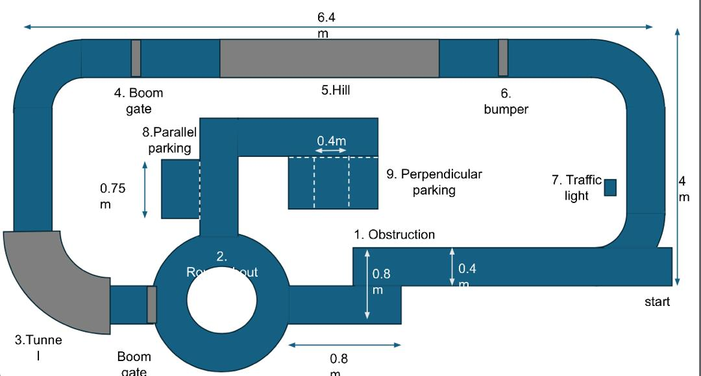
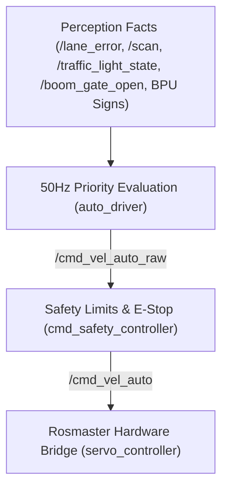

# Autonomous Challenges & Engineering Breakdown

Detailed technical breakdown of how each competition challenge is implemented in the RISA-bot autonomous software stack.

---

## Competition Course Layout

**Course Dimensions:** 6.4 m × 4.0 m track with dual lanes, inner parking area, elevated ramp (hill), rumble strips (bumpers), tunnel corridor, and automated barriers. The robot starts at the bottom-right and travels **counter-clockwise**.

### Lap Sequencing

| Lap | Sequence of Challenges |
|---|---|
| **Lap 1** | Start → Lane Follow → Obstruction (1) → Roundabout (2) → Boom Gate 1 (4) → Tunnel (3) → Boom Gate 2 (4) → Hill (5) → Bumper (6) → Traffic Light (7) → Lap 1 Complete |
| **Lap 2** | Lane Follow → Obstruction (1) → Roundabout (2) → Parallel Parking (8) → Drive to Perp → Perpendicular Parking (9) → **FINISHED** |

---

## 1. Central State Machine (`auto_driver.py`)

**File:** [`src/risabot_automode/risabot_automode/auto_driver.py`](../src/risabot_automode/risabot_automode/auto_driver.py)

The autonomous brain runs on a **50 Hz timer** (`0.02 s`). It evaluates sensory facts from perception nodes and executes a strict priority hierarchy:

```mermaid
graph TD
    SENSORS["Perception Facts (/lane_error, /scan, /traffic_light_state, /boom_gate_open, BPU Signs)"]
    PRIORITY["50Hz Priority Evaluation (auto_driver)"]
    SAFETY["Safety Limits & E-Stop (cmd_safety_controller)"]
    BRIDGE["Rosmaster Hardware Bridge (servo_controller)"]

    SENSORS --> PRIORITY
    PRIORITY -->|"/cmd_vel_auto_raw"| SAFETY
    SAFETY -->|"/cmd_vel_auto"| BRIDGE
```

- **Lap Tracking**: `current_lap` tracks Lap 1 vs Lap 2. Lap 1 advances upon passing the green traffic light; Lap 2 concludes with perpendicular parking.
- **Adaptive Speed Scaling**: Slows down proportionally during sharp curves (`speed_error_scale: 1.5`, `min_turn_speed: 0.4`).
- **Slew Rate Steering Limiter**: Clamps angular steering acceleration to `lane_steer_slew: 3.0 rad/s²` to prevent mechanical chassis twitching.

---

## 2. Challenge 1: Obstruction Avoidance

**File:** [`src/risabot_automode/risabot_automode/obstruction_avoidance.py`](../src/risabot_automode/risabot_automode/obstruction_avoidance.py)  
**Sensors:** YDLiDAR Tmini Plus (`/scan`)  
**Topics:** `/obstruction_active` (Bool), `/obstruction_cmd_vel` (Twist)

### Execution Flow
1. **Detection**: LiDAR detects a stationary obstacle in the forward corridor closer than `detect_dist` (0.50 m).
2. **Clearance Evaluation**: Scans left (+30° to +70°) and right (-30° to -70°) sectors to identify the open passing lane.
3. **3-Phase Timed Maneuver**:
   - **Phase 1 (Steer Away)**: Steers outward at `steer_angular` (0.6 rad/s) for `steer_away_duration` (1.0 s).
   - **Phase 2 (Pass)**: Drives straight alongside the obstacle for `pass_duration` (2.0 s).
   - **Phase 3 (Steer Back)**: Steers inward to re-acquire the lane for `steer_back_duration` (1.5 s).
4. **Handoff**: Sets `/obstruction_active = False` so `auto_driver` smoothly transitions to `ROUNDABOUT` mode.

---

## 3. Challenge 2: Roundabout Navigation

**Handled By:** [`auto_driver.py`](../src/risabot_automode/risabot_automode/auto_driver.py) (`ROUNDABOUT` state)  
**Sensors:** Camera Line Follower + IMU

### Execution Flow
- Triggered automatically after Obstruction Avoidance completes.
- Operates under high-curvature lane following with adjusted lookahead and asymmetric Ackermann right-boost (`auto_right_steer_boost: 1.3`).
- **Lap 1**: Continues through the circle for `t_roundabout_sec` (8.0 s) to take Exit 1 toward the Boom Gate and Tunnel.
- **Lap 2**: Exits toward the inner parking area when the Lap 2 parking signboard is detected.

---

## 4. Challenge 3: Tunnel Navigation

**File:** [`src/risabot_automode/risabot_automode/tunnel_wall_follower.py`](../src/risabot_automode/risabot_automode/tunnel_wall_follower.py)  
**Sensors:** YDLiDAR Tmini Plus (`/scan`)  
**Topics:** `/tunnel_detected` (Bool), `/tunnel_cmd_vel` (Twist)

### Execution Flow
1. **Corridor Gating**: Evaluates left (15°–120°) and right (-120° to -15°) LiDAR returns. When both sides have valid wall returns (<0.80 m), `/tunnel_detected = True`.
2. **RANSAC Line Fitting**: Fits linear models to left and right wall point clouds (50 iterations, 3 cm threshold) to reject noisy outliers.
3. **Dual-PD Control**:
   - **Lateral Centering**: `error_dist = left_dist - right_dist` → $u_{dist} = K_{p} \cdot e + K_{d} \cdot \dot{e}$ ($K_p = 5.0, K_d = 0.5$).
   - **Heading Alignment**: $\theta_{wall}$ → $u_{head} = K_{p\_head} \cdot \theta + K_{d\_head} \cdot \dot{\theta}$ ($K_{p\_head} = 1.0$).
4. Camera lane errors are ignored in the dark tunnel, ensuring immune tracking through the enclosed passage.

---

## 5. Challenge 4: Boom Gate Detection

**File:** [`src/risabot_automode/risabot_automode/boom_gate_detector.py`](../src/risabot_automode/risabot_automode/boom_gate_detector.py)  
**Sensors:** YDLiDAR + Camera Red Bar Detection  
**Topic:** `/boom_gate_open` (Bool)

### Dual-Modality Sensing
1. **LiDAR Distance Variance**: Evaluates forward arc (±20°, 0.15–0.80 m). A dense cluster with variance $< 0.05\text{ m}$ indicates a horizontal barrier bar.
2. **Camera Lower-ROI Red Segmentation**:
   - Crops lower image region (y: 0.50 to 0.95) to prevent raised gate bars from triggering false closures.
   - Applies dual-range HSV red thresholding (`sat_min: 70`, `val_min: 70`, `cam_red_min_width: 80px`).
3. **Failsafe Debounce**: Requires 5 consecutive clear frames (`hysteresis: 5`) before declaring `/boom_gate_open = True`.

---

## 6. Challenge 5 & 6: Hill Climbing, Descent & Bumpers

**Handled By:** [`auto_driver.py`](../src/risabot_automode/risabot_automode/auto_driver.py)  
**Sensors:** Horizon BPU Signage Detector + Onboard IMU (`/imu/pitch`)

### Execution Flow
1. **Signage Priming**: When `signage_detector` detects `Hill_signboard` (Class 1), it primes the hill detection window for 8.0 s (`hill_sign_prime_sec`), lowering the pitch threshold by 3°.
2. **Hill Climb Ascent (`HILL`)**:
   - Triggered when IMU pitch exceeds `hill_pitch_threshold` (8.0°).
   - Increases drive speed dynamically:
     $$v = v_{base} + (\text{pitch} - \theta_{thresh}) \cdot v_{per\_deg}$$
   - Restricts steering throw (`hill_steer_scale: 0.4`) to prevent fishtailing off the ramp edge.
3. **Hill Descent (`DESCENT`)**:
   - Triggered when pitching downhill. Enforces controlled descent speed ($0.08\text{ m/s}$) to prevent runaway momentum.
4. **Bumpers**: Handled by compliant lane following with active Kalman filtering.

---

## 7. Challenge 7: Traffic Light Detection

**Files:** [`signage_detector.py`](../src/risabot_automode/risabot_automode/signage_detector.py) & [`traffic_light_detector.py`](../src/risabot_automode/risabot_automode/traffic_light_detector.py)  
**Topic:** `/traffic_light_state` ("red", "yellow", "green", "unknown")

### Execution Flow
- **Primary Detection (BPU Neural Network)**: YOLOv5s detects `Traffic_Red` (Class 7) and `Traffic_Green` (Class 6).
- **Secondary Fallback (HSV Color Circles)**: Multi-color contour segmentation verifies active circular lights.
- **State Machine Integration (Priority 2.5)**:
  - Red / Yellow light triggers an immediate full stop.
  - Latch remains engaged until an explicit `Traffic_Green` detection is confirmed.
  - Upon green confirmation, the robot advances, clears the gate distance, and increments `current_lap` to 2.

---

## 8. Challenge 8 & 9: Parallel & Perpendicular Parking

**Files:** [`parking_controller.py`](../src/risabot_automode/risabot_automode/parking_controller.py) & [`signage_detector.py`](../src/risabot_automode/risabot_automode/signage_detector.py)  
**Sensors:** BPU YOLOv5s Sign Detection + Hardware Odometry + Record & Playback

### Execution Flow
1. **Sign Detection**: BPU detects `ParallelP_signboard` (Class 3) or `PerpendP_signboard` (Class 4).
2. **Idle Pause**: Robot enters `PARKING_IDLE` and stops for `park_wait_time` (3.0 s).
3. **Trajectory Execution (`PARKING_PLAYBACK`)**:
   - Replays precision recorded 20 Hz trajectory maneuvers (`servo_controller.py`).
   - Reverses into slot, holds 3-second mandatory dwell, and drives out to rejoin the track.
4. **Perpendicular Park & Finish**: Upon completing perpendicular parking on Lap 2, the state machine transitions to `FINISHED` and halts motors permanently.
