# Test Branch Guide (`test`)

The test branch is for **competition-ready code** with all 9 challenges integrated.

## How to Run

```bash
cd ~/risabotcar_ws/src/RISA-bot
git checkout test && gp
cb && sos
ros2 launch risabot_automode competition.launch.py
```

## What `competition.launch.py` Launches

Everything in one command:

| Node                       | Package                   | Purpose                                |
| -------------------------- | ------------------------- | -------------------------------------- |
| Astra Mini camera          | astra_camera              | Color + depth camera                   |
| YDLiDAR Tmini Plus         | ydlidar_ros2_driver       | LiDAR                                  |
| TF publisher               | tf2_ros                   | base_link → laser_frame                |
| obstacle_avoidance         | obstacle_avoidance        | LiDAR front obstacle detection         |
| obstacle_avoidance_camera  | obstacle_avoidance_camera | Camera obstacle detection              |
| line_follower_camera       | risabot_automode          | Lane error calculation                 |
| **traffic_light_detector** | risabot_automode          | Red/Yellow/Green detection             |
| **boom_gate_detector**     | risabot_automode          | Barrier detection via LiDAR            |
| **tunnel_wall_follower**   | risabot_automode          | PD wall following in tunnel            |
| **obstruction_avoidance**  | risabot_automode          | Lateral dodge maneuver                 |
| **parking_controller**     | risabot_automode          | Parallel + perpendicular parking       |
| auto_driver                | risabot_automode          | State machine brain (5s delayed start) |
| joy_node                   | joy                       | Joystick driver                        |
| servo_controller           | control_servo             | Mode toggle + manual driving           |

## Controller (Test Branch)

| Input                | Action                                                  |
| -------------------- | ------------------------------------------------------- |
| **Start button** (7) | Toggle AUTO / MANUAL mode                               |
| Left Stick           | Manual driving (forward/back + turn) — manual mode only |
| Right Stick          | Camera servo pan/tilt — always active                   |
| **RB** (5)           | Cycle to next challenge state                           |
| **LB** (4)           | Cycle to previous challenge state                       |

> Button numbers are for Xbox-style controllers. Verify with `jstest /dev/input/js0`.

## State Machine

The `auto_driver` uses a `ChallengeState` enum with **lap tracking** to manage the competition:

```mermaid
graph LR
    subgraph "Lap 1"
        S["START"] --> LF1["Lane Follow"]
        LF1 -->|"obstruction detected"| OBS1["Obstruction"]
        OBS1 -->|"cleared + dist"| RB1["Roundabout"]
        RB1 -->|"exit 1"| BG1["Boom Gate 1 (open)"]
        BG1 --> TUN["Tunnel"]
        TUN -->|"exited"| BG2["Boom Gate 2 (random)"]
        BG2 -->|"open"| HILL["Hill"]
        HILL --> BUMP["Bumper"]
        BUMP --> TL["Traffic Light"]
        TL -->|"green + dist"| LF1
    end
    subgraph "Lap 2"
        LF2["Lane Follow"] -->|"obstruction"| OBS2["Obstruction"]
        OBS2 --> RB2["Roundabout"]
        RB2 -->|"exit 2 (gate closed)"| PP["Parallel Park"]
        PP -->|"complete"| DTP["Drive to Perp"]
        DTP -->|"dist"| PERP["Perp Park"]
        PERP --> FIN["FINISHED"]
    end
    TL -.->|"lap 2 starts"| LF2
```



### How State Transitions Work

- **Automatic transitions** based on sensor triggers + distance traveled
- `current_lap` tracks lap 1 vs lap 2
- Roundabout exit logic: lap 1 → tunnel path, lap 2 → parking path
- Each state selects the appropriate `/cmd_vel` source:
  - Lane following states → uses `/lane_error` with `forward_speed` + `steering_gain`
  - Tunnel → uses `/tunnel_cmd_vel` from wall follower
  - Obstruction → uses `/obstruction_cmd_vel` from dodge module
  - Parking → uses `/parking_cmd_vel` from parking controller
  - Boom gate / traffic light → stops until condition clears
  - DRIVE_TO_PERP → lane follow from parallel to perpendicular parking area

### Manual State Override

```bash
# Jump to a specific state for testing
ros2 topic pub --once /set_challenge std_msgs/String "data: TUNNEL"
ros2 topic pub --once /set_challenge std_msgs/String "data: TRAFFIC_LIGHT"
ros2 topic pub --once /set_challenge std_msgs/String "data: PARALLEL_PARK"
```

Or use **LB/RB** on the controller to cycle through states.

### Trigger Parking Manually

```bash
ros2 topic pub --once /parking_command std_msgs/String "data: parallel"
ros2 topic pub --once /parking_command std_msgs/String "data: perpendicular"
```

## Key Topics (Test Branch)

| Topic                         | Type      | Published By                    | Purpose                  |
| ----------------------------- | --------- | ------------------------------- | ------------------------ |
| `/scan`                       | LaserScan | ydlidar                         | LiDAR data               |
| `/camera/color/image_raw`     | Image     | astra                           | Color camera             |
| `/camera/depth/image_raw`     | Image     | astra                           | Depth camera             |
| `/odom`                       | Odometry  | auto_driver                     | Wheel odometry           |
| `/cmd_vel`                    | Twist     | auto_driver or servo_controller | Motor commands           |
| `/auto_mode`                  | Bool      | servo_controller                | Auto/manual toggle       |
| `/lane_error`                 | Float32   | line_follower_camera            | Lane offset              |
| `/obstacle_front`             | Bool      | obstacle_avoidance              | Front obstacle           |
| `/traffic_light_state`        | String    | traffic_light_detector          | red/yellow/green/unknown |
| `/boom_gate_open`             | Bool      | boom_gate_detector              | Gate open/closed         |
| `/tunnel_detected`            | Bool      | tunnel_wall_follower            | In tunnel?               |
| `/tunnel_cmd_vel`             | Twist     | tunnel_wall_follower            | Tunnel steering          |
| `/obstruction_active`         | Bool      | obstruction_avoidance           | Dodging?                 |
| `/obstruction_cmd_vel`        | Twist     | obstruction_avoidance           | Dodge steering           |
| `/parking_complete`           | Bool      | parking_controller              | Parking done?            |
| `/parking_cmd_vel`            | Twist     | parking_controller              | Parking steering         |
| `/parking_signboard_detected` | Bool      | parking_controller              | Triangle sign seen?      |
| `/set_challenge`              | String    | servo_controller or CLI         | State override           |
| `/parking_command`            | String    | auto_driver or CLI              | Trigger parking type     |

## Tunable Parameters

All parameters can be changed at runtime without rebuilding:

```bash
ros2 param set /auto_driver forward_speed 0.2
ros2 param set /auto_driver dist_roundabout 2.0
```

| Node                      | Parameter                 | Default | Purpose                                     |
| ------------------------- | ------------------------- | ------- | ------------------------------------------- |
| auto_driver               | `forward_speed`           | 0.15    | Forward speed during lane follow (m/s)      |
| auto_driver               | `steering_gain`           | 0.5     | Lane error → angular velocity gain          |
| auto_driver               | `stale_timeout`           | 3.0     | Seconds before module data treated as stale |
| auto_driver               | `dist_obstruction_clear`  | 0.3     | Distance after obstruction clears (m)       |
| auto_driver               | `dist_roundabout`         | 1.5     | Distance through roundabout (m)             |
| auto_driver               | `dist_boom_gate_1_pass`   | 0.5     | Distance after boom gate 1 (m)              |
| auto_driver               | `dist_boom_gate_2_pass`   | 0.5     | Distance after boom gate 2 (m)              |
| auto_driver               | `dist_hill`               | 1.0     | Distance over hill (m)                      |
| auto_driver               | `dist_bumper`             | 0.8     | Distance over bumpers (m)                   |
| auto_driver               | `dist_traffic_light_pass` | 0.5     | Distance after green light (m)              |
| auto_driver               | `dist_drive_to_perp`      | 1.0     | Distance to perp parking area (m)           |
| line_follower_camera      | `show_debug`              | False   | Show debug window (set True on desktop)     |
| obstacle_avoidance        | `min_obstacle_distance`   | 0.48    | Detection threshold (m)                     |
| obstacle_avoidance_camera | `white_threshold`         | 200     | White surface intensity threshold           |
| obstacle_avoidance_camera | `hysteresis_on`           | 3       | Consecutive frames to trigger               |
| obstacle_avoidance_camera | `hysteresis_off`          | 5       | Consecutive frames to clear                 |

## Differences from Main

| Feature         | Main                                     | Test                                                 |
| --------------- | ---------------------------------------- | ---------------------------------------------------- |
| Launch command  | `run_risabot`                            | `ros2 launch risabot_automode competition.launch.py` |
| Auto mode       | Monolithic controller handles everything | State machine + modular nodes                        |
| Manual driving  | Through `Rosmaster.set_motor()` directly | Through `/cmd_vel` topic                             |
| Challenges      | Lane follow + basic dodge                | All 9 competition challenges                         |
| Camera          | Launched separately                      | Included in launch file                              |
| Serial conflict | ⚠️ Controller and auto_driver fight      | ✅ Only auto_driver uses serial                      |
