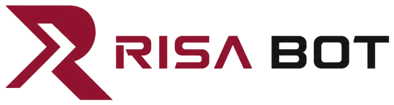
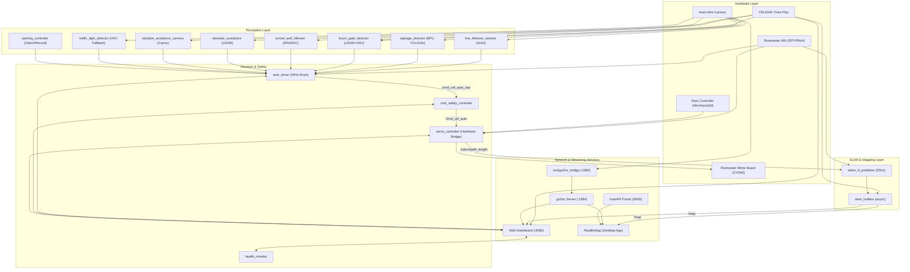

<p align="center">
  <picture>
    <source media="(prefers-color-scheme: dark)" srcset="assets/flair/risabot_flair_dark.png">
    
  </picture>
</p>

# RISA-bot

**ROS 2 Intelligent System Autonomy — Competition Robot Platform**

RISA-bot is a competition-grade autonomous vehicle built on **ROS 2 Humble** and hosted on the **Horizon Sunrise RDK X5** (ARM64 Ubuntu 22.04). It integrates hardware-accelerated computer vision (BPU), 2D LiDAR SLAM, multi-scanline lane following, dual-modal perception, a 17-state priority-governed autonomous state machine, and a multi-service web & desktop companion suite.

---

## ⚡ Quick Start: Companion App (No Build Required)

For end users who just want to run the companion app without compiling or installing .NET:
- **Direct Executable**: Double-click [`dist/RisaBotApp/RisaBotApp.exe`](file:///c:/Users/eemrull/RISA-bot/dist/RisaBotApp/RisaBotApp.exe) or run [`Launch-RisaBotApp.bat`](file:///c:/Users/eemrull/RISA-bot/Launch-RisaBotApp.bat) from the root folder.
- **Features**: Automatic robot mDNS discovery, live camera streams, real-time telemetry HUD, virtual joystick control, 2D SLAM mapping, and BPU model manager.

---

## 🌟 Key Capabilities

- **Autonomous Decision Engine (`auto_driver`)**: 17-state priority-ordered state machine running at 50 Hz with lap tracking, adaptive speed scaling, slew-rate steering limitation, and failsafe recovery.
- **BPU Hardware-Accelerated AI (`signage_detector`)**: Real-time YOLOv5s INT8 inference on the Horizon RDK X5 BPU (via `hobot_dnn`/`pyeasy_dnn`) detecting parking signboards, hill signs, and traffic lights.
- **2D SLAM & Mapping (`risabot_slam` & `slam_toolbox`)**: Live 2D occupancy grid mapping with backwards-LiDAR transform ($\pi$ yaw correction), low-latency PNG compression streaming, and process-respawn "Restart Mapping".
- **High-Performance Lane Following (`line_follower_camera`)**: Vectorized 8-scanline Cytron-style lane detection (~31 Hz) with CLAHE contrast enhancement, Kalman filtering, curve search, and nominal lane width validation (20–42 cm).
- **Dual-Modal Perception**:
  - **Boom Gate Detector**: Combines LiDAR point cluster variance with lower-half camera ROI (y 0.50–0.95) red bar HSV segmentation.
  - **Tunnel Wall Follower**: RANSAC line fitting and PD heading/distance control.
  - **Hill Climb & Descent**: IMU pitch angle detection with sign-based priming and speed boost.
  - **Parking Maneuvers**: Odometry-driven and 20 Hz fixed-interval Record & Playback trajectories.
- **Multi-Service Network Stack (4 Ports)**:
  - **Port 8000**: FastAPI WiFi Provisioning Portal, systemd launch control, and BPU model upload/rollback.
  - **Port 8080**: Built-in ROS 2 Web Dashboard for camera views, sensor HUD, live parameter tuning/saving, SLAM, data logger, and record/playback.
  - **Port 1984**: `go2rtc` low-latency WebRTC/MJPEG streaming server.
  - **Port 1985**: `ros2go2rtc_bridge` camera MJPEG source with dynamic debug view routing.
- **Companion App (`RisaBotApp`)**: Windows desktop companion app (.NET MAUI / WinUI 3) with robot discovery, live camera, telemetry HUD, virtual RC controls, SLAM map visualization, and BPU model card manager.
- **Fleet & Diagnostic Tooling**: Paramiko multi-robot deployment (`bulk_setup_robots.py`), automated rosbag regression validator (`bag_regression_validator.py`), and live BPU testing (`verify_live.py`).

---

## 🏗️ System Architecture & Ports



### Network Ports

| Port | Service | Protocol / Format | Provided By | Purpose |
|---|---|---|---|---|
| **8000** | Provisioning Portal | HTTP / JSON REST API | `tools/wifi_provisioning/backend/app.py` | WiFi setup, BPU model upload/rollback, `risabot.service` launch start/stop |
| **8080** | ROS 2 Web Dashboard | HTTP / REST & WebSockets | `dashboard.py` + `dashboard_templates.py` | Live sensor HUD, parameter tuning, SLAM map, Data Logger, camera switcher |
| **1984** | go2rtc Server | WebRTC / HTTP MJPEG | `tools/go2rtc/` | High-performance low-latency stream consumed by browsers and Desktop App |
| **1985** | Camera Stream Bridge | HTTP MJPEG | `ros2go2rtc_bridge.py` | Internal bridge converting ROS image topics to MJPEG for go2rtc |

---

## 🚀 Installation & Setup

### 1. Fresh Installation (From Scratch on Robot)

For setting up a **new robot** (Horizon RDK X5 / Ubuntu 22.04 with ROS 2 Humble or TROS):

```bash
# 1. Clone workspace (includes third-party dependencies)
git clone https://github.com/eemrull/RISA-bot.git ~/risabotcar_ws
cd ~/risabotcar_ws

# 2. Run the automated installer (installs apt/pip deps, builds YDLidar-SDK, sets udev rules & aliases)
bash tools/install.sh

# 3. Reboot to apply udev rules, group permissions, and environment variables
sudo reboot
```

> **Note:** The installer configures `COLCON_IGNORE` on heavy C++ vendor packages (`ros2_astra_camera`, `ydlidar_ros2_driver`) after the first build. This accelerates subsequent builds of your Python packages from minutes down to ~5 seconds!

### 2. Deploy BPU AI Model

Deploy the compiled YOLOv5s model (`risabot_signs_640x640_nv12.bin`) to `/home/sunrise/`:

- **Option A (Via Companion App or Web Portal):** Open Settings in [RisaBotApp](RisaBotApp/) or `http://<robot_ip>:8000`, upload the `.bin` model file.
- **Option B (Via SCP from PC):**
  ```bash
  scp tools/bpu_model/model_output/risabot_signs_640x640_nv12.bin sunrise@<robot_ip>:/home/sunrise/
  ```

Verify BPU execution on the robot:
```bash
python3 tools/bpu_model/verify_bpu.py
```

### 3. Setup WiFi & Headless Hotspot

```bash
# Connect to a WiFi router or phone hotspot:
sudo bash tools/setup_wifi.sh "MY_WIFI_SSID" "MY_PASSWORD"

# Or configure standalone Access Point fallback on the robot:
sudo bash tools/wifi_hotspot_setup.sh
```

---

## 🎮 Daily Workflow & Launch Options

### Fast Rebuild & Source Aliases

| Command | Action | When to Use |
|---|---|---|
| `cb` | `colcon build --symlink-install` | Standard build after editing code |
| `cbp <pkg>` | `colcon build --packages-select <pkg>` | Fastest build for a single package (e.g. `cbp risabot_automode`) |
| `cbc` | Clean Python build (`rm -rf build/install` for python pkgs + build) | When package entry points or resources change |
| `cbd` | Full workspace purge & rebuild | Clean rebuild when CMake/ament cache is corrupted |
| `sos` | `source install/setup.bash` | Re-source workspace after building |

---

### Launch Modes

#### 1. Full Autonomous Competition Bringup (Primary)
Launches all sensors (Camera, LiDAR, IMU, Joystick), all perception nodes, state machine brain, safety controller, web dashboard, go2rtc bridge, and 2D SLAM:

```bash
ros2 launch risabot_automode bringup.launch.py
```

> **Tip:** To conserve CPU if SLAM is not needed during a timed run, pass `slam:=false`:
> ```bash
> ros2 launch risabot_automode bringup.launch.py slam:=false
> ```

#### 2. Isolated Lane Follower Testing
Launches Camera, Joystick, Servo Controller, Line Follower, and Auto Driver only (no LiDAR or SLAM):

```bash
ros2 launch risabot_automode lane_test.launch.py
```

#### 3. Isolated SLAM Mapping
Launches LiDAR, Servo Controller, odometry TF publisher, and SLAM Toolbox for standalone mapping:

```bash
ros2 launch risabot_slam slam_test.launch.py
```

#### 4. Manual RC Drive Only
Launches Joystick and Servo Controller hardware bridge for pure manual RC driving:

```bash
ros2 launch control_servo robot_rc.launch.py
```

#### 5. Multi-Tab / Tmux Debug Launcher
Opens each core node in separate terminal tabs (`run_risabot` for X11 desktop, `run_trisabot` for SSH tmux sessions):

```bash
run_risabot    # Desktop GUI
run_trisabot   # SSH Tmux
```

---

## 🧪 Testing & Verification Workflows

### 1. Gamepad Controller Safety Unlock
Every time `servo_controller` launches, an intentional safety lock prevents accidental runaway from joystick drift:
1. Turn on/connect the gamepad (`/dev/input/js0`).
2. Press any button (e.g., `A` or `Y`). Terminal logs: `Controller unlocked (Button press detected)`.
3. Return both sticks to neutral dead center. Terminal logs: `Controller neutral detected, manual drive enabled`.
4. Press **Start button** (Button 7) to toggle between **MANUAL** and **AUTO** modes.

### 2. Live BPU Inference Verification
Test the camera and Horizon BPU inference pipeline on live frames with bounding box diagnostics:

```bash
python3 tools/bpu_model/verify_live.py
```

### 3. Automated Rosbag Regression Validator
Validate system stability, loop frequencies, topic freshness, and overrun health using recorded or live rosbags:

```bash
# Record telemetry bag:
ros2 bag record /loop_stats /health_status /cmd_safety_status /cmd_vel_auto /odom

# Run automated validation suite:
ros2 run risabot_automode bag_regression_validator --ros-args -p window_sec:=45.0 -p output_file:=/tmp/risa_regression.json
```

### 4. Topic Health & Loop Frequency Checks

```bash
# Verify health monitor status:
ros2 topic echo /health_status

# Verify 50Hz control loop frequency and overruns:
ros2 topic echo /loop_stats

# Monitor perception error signals:
ros2 topic echo /lane_error
ros2 topic echo /traffic_light_state
ros2 topic echo /boom_gate_open
ros2 topic echo /tunnel_detected
```

---

## 🖥️ User Interfaces

### 1. Built-in Web Dashboard (`http://<robot_ip>:8080`)

Accessible from any web browser on the local network (or `http://risabot.local:8080` via mDNS):
- **Live Video Feed**: Raw, Lane Lines (scanline debug), Obstacle (Canny edge overlay), Signage (YOLO bounding boxes), and Traffic Light.
- **Sensor HUD & State**: Current state machine priority, active lap, emergency stop status, odometry distance & speed, LiDAR proximity.
- **Slide-out Parameter Tuning**: Live `get_param` and `set_param` for all nodes with **"Save as Default"** to permanently persist values to `params.yaml`.
- **SLAM Map Visualizer**: Live rendering of SLAM occupancy grid with Pause and Restart Mapping controls.
- **Subsystem Data Logger**: Start/Stop CSV recording of control, sensor, and state telemetry directly saved to `~/risabotcar_ws/data_logs/`.
- **Record & Playback**: Trigger and record parking maneuvers directly from the UI.

### 2. Desktop Companion App (`RisaBotApp/`)

A dedicated Windows desktop application built with WPF and .NET 10.

```powershell
# Build and run on your Windows developer PC:
cd RisaBotApp
dotnet build RisaBotApp.csproj
.\bin\Debug\net10.0-windows\RisaBotApp.exe
```

**Features:**
- Automatic mDNS robot discovery (`risabot.local`) and subnet IP scan.
- Full Telemetry HUD, camera streaming via go2rtc, and controller visualization.
- Interactive SLAM occupancy grid viewer (replacing the need for RViz on a laptop).
- BPU Model Card manager with one-click upload, validation, and rollback.

---

## ⚙️ Configuration & Parameter Tuning

The single source of configuration truth is located at:
[`src/risabot_automode/config/params.yaml`](src/risabot_automode/config/params.yaml)

### Most Frequently Tuned Parameters

```bash
# Auto Driver / Lane Follower
ros2 param set /auto_driver forward_speed 0.15              # Base straight speed (m/s)
ros2 param set /auto_driver pid_kp 0.8                      # Proportional steering gain
ros2 param set /auto_driver pid_kd 0.20                     # Derivative steering damping
ros2 param set /line_follower_camera white_threshold 100    # Lane threshold (inverted mode: 80-120)
ros2 param set /line_follower_camera crop_ratio_base 0.55   # Camera forward lookahead (0.4-0.6)

# Boom Gate
ros2 param set /boom_gate_detector cam_red_min_width 80     # Min red bar width in px
ros2 param set /boom_gate_detector hysteresis 5             # Debounce frame count

# Tunnel Wall Follower
ros2 param set /tunnel_wall_follower kp 5.0                 # Lateral centering gain
ros2 param set /tunnel_wall_follower kp_heading 1.0         # Wall heading alignment gain

# Hill Climbing / Descent
ros2 param set /auto_driver hill_pitch_threshold 8.0        # Pitch degrees to trigger hill mode
ros2 param set /auto_driver hill_base_speed 0.18            # Starting hill speed (m/s)

# Odometry & Hardware
ros2 param set /servo_controller ticks_per_meter 6249.0     # Calibrated encoder resolution
ros2 param set /servo_controller auto_right_steer_boost 1.3 # Ackermann asymmetric right-turn multiplier
```

---

## 🛠️ Troubleshooting Reference

### 1. `servo_controller` crashes with serial error (`/dev/myserial`)
- **Cause:** `/dev/myserial` is pointing to the LiDAR port or another process is holding the port.
- **Check:** `ls -l /dev/myserial` should point to `ttyUSB0` (CH340 chip, `1a86:7523`).
- **Fix:** Re-apply udev rules (`sudo udevadm control --reload-rules && sudo udevadm trigger`) and physically replug the motor board USB cable.

### 2. Camera fails to start with `openni2_redist` missing
- **Fix:** Run the alias `fix_astra` or rebuild the package:
  ```bash
  colcon build --symlink-install --packages-select astra_camera && sos
  ```

### 3. DDS / FastRTPS shared memory crashes
- **Cause:** `/dev/shm` segment corruption across fast process restarts on RDK X5.
- **Fix:** FastRTPS shared memory is disabled via `config/disable_shm.xml` and loaded automatically in all launch files. Verify `echo $FASTRTPS_DEFAULT_PROFILES_FILE` is set.

### 4. Web Dashboard or Camera Stream Port Conflicts
- If `risabot.service` is running in the background while launching manually:
  ```bash
  sudo systemctl stop risabot
  ```

---

## 📚 Detailed Documentation & Guides

Comprehensive guides and documentation are organized across the workspace:

| Guide / Directory | Description |
|---|---|
| [ARCHITECTURE.md](ARCHITECTURE.md) | Node graph, 17-state machine table, AI BPU pipeline, data flows |
| [Guide/README.md](Guide/README.md) | Index of competition, tuning, odometry, and hardware validation guides |
| [Guide/commands_reference.md](Guide/commands_reference.md) | Comprehensive ROS 2 CLI commands, topics, parameters, and aliases |
| [Guide/tuning_guide.md](Guide/tuning_guide.md) | Step-by-step parameter tuning for all 9 physical course challenges |
| [Guide/challenges_breakdown.md](Guide/challenges_breakdown.md) | In-depth engineering breakdown of every autonomous challenge |
| [Guide/deployment_guide.md](Guide/deployment_guide.md) | Complete step-by-step setup guide for new robot hardware |
| [Guide/Odometer_Guide.md](Guide/Odometer_Guide.md) | Hardware encoder odometry equations, calibration, and TF broadcasting |
| [Guide/competition_validation_guide.md](Guide/competition_validation_guide.md) | Hardware acceptance criteria, safety tests, and regression workflows |
| [Guide/bpu_model_training_guide.md](Guide/bpu_model_training_guide.md) | Colab YOLOv5s training, ONNX patching, and Docker BPU quantization |
| [tools/README.md](tools/README.md) | Reference for all deployment scripts, fleet utilities, and BPU tools |
| [module/README.md](module/README.md) | Educational learning modules covering ROS 2, vision, LiDAR, and BPU |
| [Workshop/README.md](Workshop/README.md) | Hands-on workshop training curriculum and cheat sheets |
